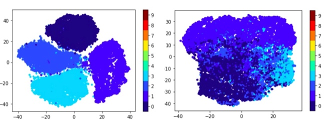
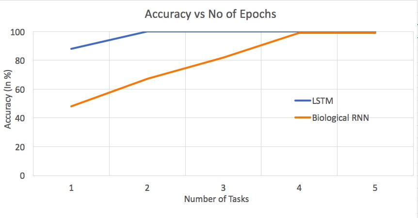
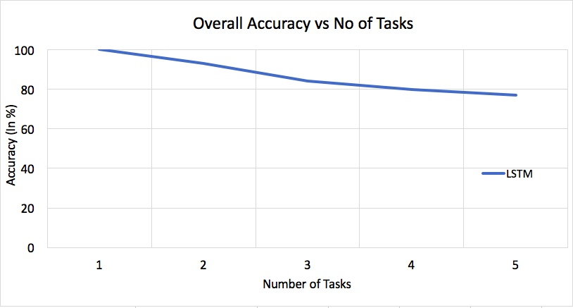
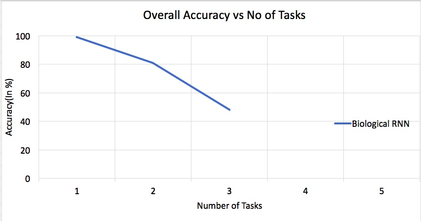
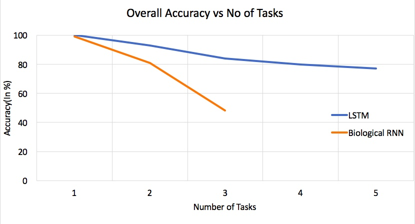

# Mitigating Catastrophic Forgetting in LSTM-RNNs and Biologically Constrained RNNs

For my Masters' Thesis, I employed Deep Generative Replay to Mitigate Catastrophic Forgetting in LSTMs and Biologically Constrained RNNs. Deep Generative Replay is a framework for Mitigating Catastrophic Forgetting in Neural Networks where acccess to past data may not be available. It involves training a Generative Model to learn to generate pseudo samples of old data that resemble real samples of old data. Samples generated by this Generative Model are then replayed interspersed with new data, when the original neural network is trained to learn the next task. This is inspired by how humans and other mammals are able to acquire new knowledge while retaining previously learnt information. The Generative Model(GAN) and the LSTM were built in Pytorch, while the Biologically Inspired RNN was written in Theanos. The Biologically Constrained RNN used here is a heavily adapted version of the network used in [Pycog](https://github.com/frsong/pycog), but with massive modifications, be it to the kind of data the network can accept as input, to the optimisation algorithm itself. The code for the Biological RNN can be found in the ['pycog-master' folder](pycog-master), while the code for the GAN and the LSTM can be found in the ['MainCode1.ipynb'](MainCode1.ipynb) and ['MainCode2.ipynb'](MainCode2.ipynb) files. The Biological Constraints which have been imposed, Dale's Law, and Plasticity Constraints are explained in the Thesis. I was advised by Professor Zhe Chen at NYU's Department of Neuroscience and Professor Davi Geiger at NYU's Courant Institute on this Thesis.

## MNIST Dataset :

MNIST Images are 28 x 28 pixels. For the RNNs/LSTMs to learn MNIST Digits, I used a Sequence Length of 28, providing a 28 dimensional input to the network, at each Time Step.

## Training Algorithm (Deep Generative Replay):

## True Samples vs Pseudo Samples Generated by the GAN:

### True Samples

### Samples Generated by the GAN

### t-SNE Plots of the True Samples vs GAN Samples

The pane on the right represents the digit

## Results:

### Baselines:

### LSTM

### Biologically Constrained RNN

### LSTM vs Biological RNN

One can see that Deep Generative Replay is quite effective at restricting catastrophic forgetting in the LSTM but not as much in the Biological RNN, perhaps due to the additional constraints.

## Thesis:

[Thesis](Amartya_Thesis.pdf)

## Referencing:

Please reference this work, if you decide to use it.
